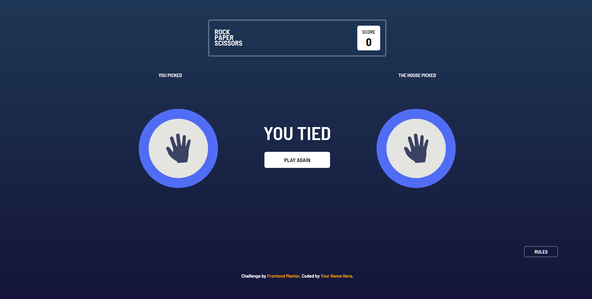
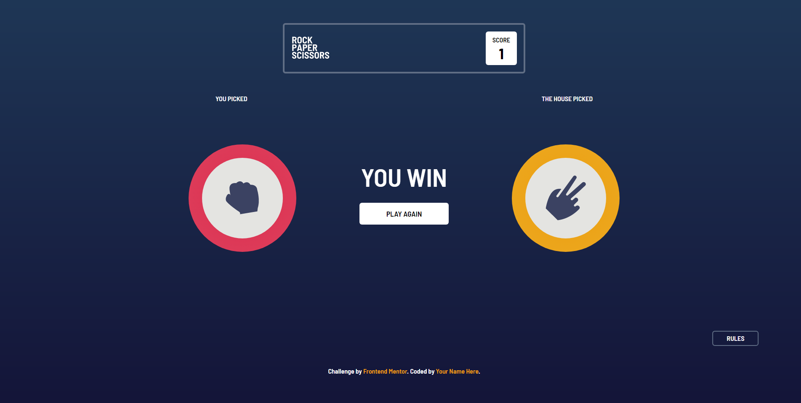
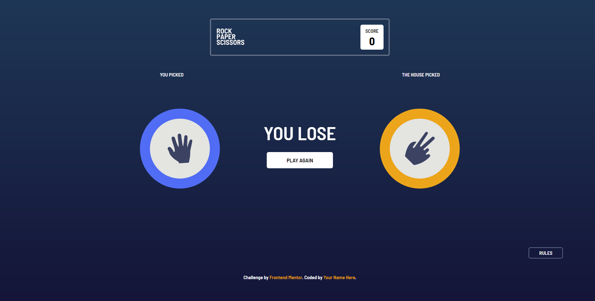

# Frontend Mentor - Rock, Paper, Scissors solution

This is a solution to the [Rock, Paper, Scissors challenge on Frontend Mentor](https://www.frontendmentor.io/challenges/rock-paper-scissors-game-pTgwgvgH). Frontend Mentor challenges help you improve your coding skills by building realistic projects. 

## Table of contents

- [Overview](#overview)
  - [The challenge](#the-challenge)
  - [Screenshot](#screenshot)
  - [Links](#links)
- [My process](#my-process)
  - [Built with](#built-with)
  - [Continued development](#continued-development)
- [Author](#author)

## Overview

### The challenge

Users should be able to:

- View the optimal layout for the game depending on their device's screen size
- Play Rock, Paper, Scissors against the computer
- Maintain the state of the score after refreshing the browser _(Still working on)_
- **Bonus**: Play Rock, Paper, Scissors, Lizard, Spock against the computer _(Future Updates)_

### Screenshot

The gameplay is built for only rock, paper and scissors, So the possibilities are:

- Either you tie:
 

- Or you win:

- Or you lose:
 

Every Other design can be found in the 

### Links

- Solution URL: [Add solution URL here](https://your-solution-url.com)
- Live Site URL: [Add live site URL here](rps.netlify.app)

## My process

### Built with

- Semantic HTML5 markup
- CSS custom properties
- Flexbox
- CSS Grid
- Mobile-first workflow
- DOM manipulation
- JS Methods
- [Tailwind CSS](https://tailwindui.com/) - CSS framework
- [JQuery](https://api.jquery.com/) - JS library

### Continued development

Next Features:

- Maintain the state of the score after refreshing the browser
- Multiplayer Mode
- LeaderBoard Stats
- **Bonus**: Play Rock, Paper, Scissors, Lizard, Spock against the computer

## Author

- Website - [Michael Ajayi](https://michael-a.netlify.app)
- Frontend Mentor - [@michaelajayi150](https://www.frontendmentor.io/profile/michaelajayi150)
- Twitter - [@michaelajayi150](https://www.twitter.com/michaelajayi150)
- LinkedIn - [@ajayi-michael-692bb6203](https://www.linkedin.com/in/ajayi-michael-692bb6203/)
